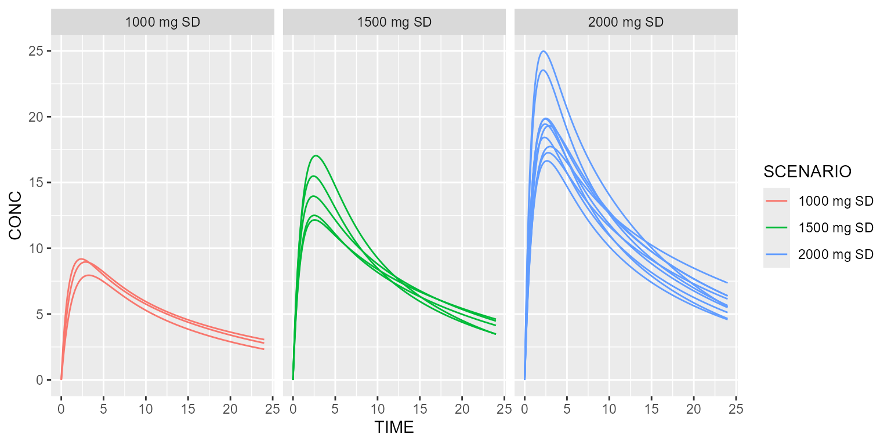
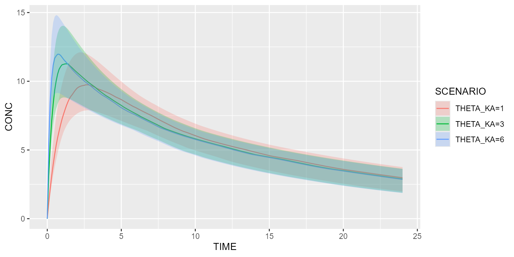

# Scenarios

This vignette shows how scenarios can be implemented.

### Simulate several protocols at once

Using treatment arms:

``` r
model <- model_suite$nonmem$advan4_trans4

arm1 <- Arm(subjects=3, label="1000 mg SD") %>%
  add(Bolus(time=0, 1000)) %>%
  add(Observations(times=seq(0, 24, by=0.1)))

arm2 <- Arm(subjects=5, label="1500 mg SD") %>%
  add(Bolus(time=0, 1500)) %>%
  add(Observations(times=seq(0, 24, by=0.1)))

arm3 <- Arm(subjects=10, label="2000 mg SD") %>%
  add(Bolus(time=0, 2000)) %>%
  add(Observations(times=seq(0, 24, by=0.1)))

results <- model %>% simulate(dataset=Dataset() %>% add(c(arm1, arm2, arm3)), seed=1)
spaghettiPlot(results, "CONC", "ARM") + ggplot2::facet_wrap(~ARM)
```


Using scenarios:

``` r
model <- model_suite$nonmem$advan4_trans4

dataset <- Dataset() %>%
    add(Observations(times=seq(0, 24, by=0.1)))

scenarios <- Scenarios() %>% 
  add(Scenario("1000 mg SD", dataset=~.x %>% setSubjects(3) %>% add(Bolus(time=0, 1000)))) %>%
  add(Scenario("1500 mg SD", dataset=~.x %>% setSubjects(5) %>% add(Bolus(time=0, 1500)))) %>%
  add(Scenario("2000 mg SD", dataset=~.x %>% setSubjects(10) %>% add(Bolus(time=0, 2000))))

results <- model %>% simulate(dataset=dataset, scenarios=scenarios, seed=1)
spaghettiPlot(results, "CONC", "SCENARIO") + ggplot2::facet_wrap(~SCENARIO)
```



### Make a model parameter vary

Assume we want to test different values of `THETA_KA`:

``` r
model <- model_suite$nonmem$advan4_trans4

ds <- Dataset(50) %>%
  add(Bolus(time=0, amount=1000)) %>%
  add(Observations(times=seq(0, 24, by=0.1))) 

scenarios <- Scenarios() %>% 
  add(Scenario("THETA_KA=1", model=~.x %>% replace(Theta(name="KA", value=1)))) %>%
  add(Scenario("THETA_KA=3", model=~.x %>% replace(Theta(name="KA", value=3)))) %>%
  add(Scenario("THETA_KA=6", model=~.x %>% replace(Theta(name="KA", value=6))))

results <- model %>% simulate(dataset=ds, scenarios=scenarios, seed=1)
shadedPlot(results, "CONC", "SCENARIO")
```



### Compare different distributions

Assume we want to compare different distributions of body weight `BW`:

``` r
model <- model_suite$nonmem$advan1_trans2 %>% 
  replace(Equation("CL", "THETA_CL*exp(ETA_CL)*pow(BW/70, 0.75)")) %>% 
  disable("IIV")

ds <- Dataset(50) %>%
  add(Bolus(time=0, amount=1000)) %>%
  add(Observations(times=seq(0, 24, by=0.1))) %>%
  add(Covariate("BW", 70))

scenarios <- Scenarios() %>% 
  add(Scenario("Constant BW")) %>%
  add(Scenario("BW ∼ Uniform distribution", dataset=~.x %>% replace(Covariate("BW", UniformDistribution(min=60, max=80))))) %>%
  add(Scenario("BW ∼ Normal distribution", dataset=~.x %>% replace(Covariate("BW", NormalDistribution(mean=70, sd=10)))))

results <- model %>% simulate(dataset=ds, scenarios=scenarios, seed=1)
shadedPlot(results, "CONC", "SCENARIO") + ggplot2::facet_wrap(~SCENARIO, ncol=1)
```


