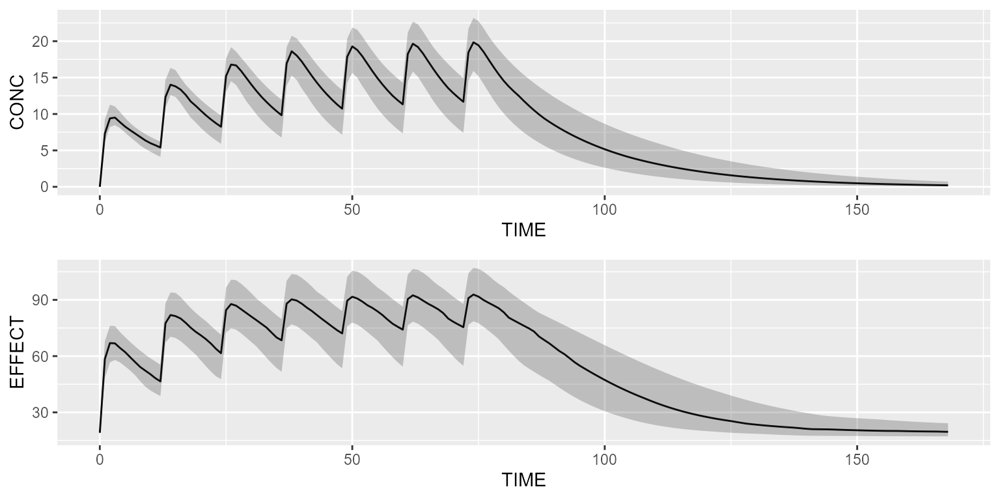

# PK/PD model library

This vignette presents a couple of pharmacodynamic models (PD) from the
model library that can be linked to an existing PK model.

In order to not repeat ourselves, all the below pharmacodynamic models
will be linked to our reference 2-compartment PK model from the library.

``` r
pk <- model_suite$nonmem$advan4_trans4
```

### Direct-effect model

Load the direct-effect model from the model library:

``` r
pd <- model_suite$pd$direct_effect_model
pd
```

    ## [MAIN]
    ## EMAX=THETA_EMAX*exp(ETA_EMAX)
    ## EC50=THETA_EC50*exp(ETA_EC50)
    ## GAMMA=THETA_GAMMA*exp(ETA_GAMMA)
    ## E0=THETA_E0*exp(ETA_E0)
    ## 
    ## [ODE]
    ## PK_CONC=10
    ## EFFECT=E0 + EMAX*pow(PK_CONC, GAMMA)/(pow(EC50, GAMMA) + pow(PK_CONC, GAMMA))
    ## 
    ## 
    ## THETA's:
    ##    name index value   fix                        label  unit
    ## 1  EMAX     1 100.0 FALSE               Maximum effect  <NA>
    ## 2  EC50     2  10.0 FALSE Concentration at 50% of EMAX ng/mL
    ## 3 GAMMA     3   1.5 FALSE             Hill coefficient  <NA>
    ## 4    E0     4  20.0 FALSE                     Baseline  <NA>
    ## OMEGA's:
    ##    name index index2 value   fix type
    ## 1  EMAX     1      1    10 FALSE  cv%
    ## 2  EC50     2      2    10 FALSE  cv%
    ## 3 GAMMA     3      3    10 FALSE  cv%
    ## 4    E0     4      4    10 FALSE  cv%
    ## SIGMA's:
    ## # A tibble: 0 × 0
    ## No variance-covariance matrix
    ## 
    ## Compartments:

Link the PD model to the PK model as follows:

``` r
pkpd <- pk %>% add(pd)
pkpd <- pkpd %>% replace(Equation("PK_CONC", "A_CENTRAL/S2"))
```

Simulate the PK/PD model with a basic dataset:

``` r
library(campsis)
dataset <- Dataset(25) %>% 
  add(Bolus(time=0, amount=1000, compartment=1, ii=12, addl=6)) %>%
  add(Observations(times=0:168))
results <- pkpd %>% simulate(dataset=dataset, seed=1)

gridExtra::grid.arrange(shadedPlot(results, "CONC"), shadedPlot(results, "EFFECT"), ncol=1)
```



### Effect-compartment model

Load the effect-compartment model from the model library:

``` r
pd <- model_suite$pd$effect_cmt_model
pd
```

    ## [MAIN]
    ## EMAX=THETA_EMAX*exp(ETA_EMAX)
    ## EC50=THETA_EC50*exp(ETA_EC50)
    ## GAMMA=THETA_GAMMA*exp(ETA_GAMMA)
    ## E0=THETA_E0*exp(ETA_E0)
    ## KE0=THETA_KE0*exp(ETA_KE0)
    ## 
    ## [ODE]
    ## PK_CONC=10
    ## d/dt(A_ECONC)=KE0*(PK_CONC - A_ECONC)
    ## EFFECT=E0 + EMAX*pow(A_ECONC, GAMMA)/(pow(EC50, GAMMA) + pow(A_ECONC, GAMMA))
    ## 
    ## 
    ## THETA's:
    ##    name index value   fix                         label  unit
    ## 1  EMAX     1 100.0 FALSE                Maximum effect  <NA>
    ## 2  EC50     2  10.0 FALSE  Concentration at 50% of EMAX ng/mL
    ## 3 GAMMA     3   1.5 FALSE              Hill coefficient  <NA>
    ## 4    E0     4  20.0 FALSE                      Baseline  <NA>
    ## 5   KE0     5   0.5 FALSE Effect compartment delay rate   1/h
    ## OMEGA's:
    ##    name index index2 value   fix type
    ## 1  EMAX     1      1    10 FALSE  cv%
    ## 2  EC50     2      2    10 FALSE  cv%
    ## 3 GAMMA     3      3    10 FALSE  cv%
    ## 4    E0     4      4    10 FALSE  cv%
    ## 5   KE0     5      5    10 FALSE  cv%
    ## SIGMA's:
    ## # A tibble: 0 × 0
    ## No variance-covariance matrix
    ## 
    ## Compartments:
    ## A_ECONC (CMT=1)

Link the PD model to the PK model as follows:

``` r
pkpd <- pk %>% add(pd)
pkpd <- pkpd %>% replace(Equation("PK_CONC", "A_CENTRAL/S2"))
```

Simulate the PK/PD model with a basic dataset:

``` r
library(campsis)
dataset <- Dataset(25) %>% 
  add(Bolus(time=0, amount=1000, compartment=1, ii=12, addl=2)) %>%
  add(Observations(times=0:36))
results <- pkpd %>% simulate(dataset=dataset, seed=1)

gridExtra::grid.arrange(shadedPlot(results, "CONC"), shadedPlot(results, "EFFECT"), ncol=1)
```


### Transit-compartment model

Load the transit-compartment model from the model library:

``` r
pd <- model_suite$pd$transit_cmt_model
pd
```

    ## [MAIN]
    ## BASE=THETA_BASE*exp(ETA_BASE)
    ## POWER=THETA_POWER*exp(ETA_POWER)
    ## MTT=THETA_MTT*exp(ETA_MTT)
    ## SLOPE=THETA_SLOPE*exp(ETA_SLOPE)
    ## KTR=4/MTT
    ## 
    ## [ODE]
    ## PK_CONC=10
    ## DRUG=SLOPE*PK_CONC
    ## d/dt(A_PROL)=KTR*A_PROL*pow(BASE/A_CIRC, POWER)*(1-DRUG)-KTR*A_PROL
    ## d/dt(A_TRANS1)=KTR*A_PROL - KTR*A_TRANS1
    ## d/dt(A_TRANS2)=KTR*A_TRANS1 - KTR*A_TRANS2
    ## d/dt(A_TRANS3)=KTR*A_TRANS2 - KTR*A_TRANS3
    ## d/dt(A_CIRC)=KTR*A_TRANS3- KTR*A_CIRC
    ## 
    ## [INIT]
    ## A_PROL=BASE
    ## A_TRANS1=BASE
    ## A_TRANS2=BASE
    ## A_TRANS3=BASE
    ## A_CIRC=BASE
    ## 
    ## 
    ## THETA's:
    ##    name index   value   fix
    ## 1  BASE     1 1.0e+03 FALSE
    ## 2 POWER     2 1.5e-01 FALSE
    ## 3   MTT     3 1.0e+02 FALSE
    ## 4 SLOPE     4 5.0e-03 FALSE
    ## OMEGA's:
    ##    name index index2 value   fix type
    ## 1  BASE     1      1    10 FALSE  cv%
    ## 2 POWER     2      2    10 FALSE  cv%
    ## 3   MTT     3      3    10 FALSE  cv%
    ## 4 SLOPE     4      4    10 FALSE  cv%
    ## SIGMA's:
    ## # A tibble: 0 × 0
    ## No variance-covariance matrix
    ## 
    ## Compartments:
    ## A_PROL (CMT=1)
    ## A_TRANS1 (CMT=2)
    ## A_TRANS2 (CMT=3)
    ## A_TRANS3 (CMT=4)
    ## A_CIRC (CMT=5)

Link the PD model to the PK model as follows:

``` r
pkpd <- pk %>% add(pd)
pkpd <- pkpd %>% replace(Equation("PK_CONC", "A_CENTRAL/S2"))
```

Simulate the PK/PD model with a basic dataset:

``` r
library(campsis)
dataset <- Dataset(25) %>% 
  add(Bolus(time=0, amount=1000, compartment=1, ii=12, addl=35)) %>%
  add(Observations(times=0:1000))
results <- pkpd %>% simulate(dataset=dataset, seed=1)

gridExtra::grid.arrange(shadedPlot(results, "CONC"), shadedPlot(results, "A_CIRC"), ncol=1)
```


### Indirect-response model

Load one of the 4 indirect-response model (IRM) present in the model
library:

``` r
pd <- model_suite$pd$irm_kout_inhibition
pd
```

    ## [MAIN]
    ## IC50=THETA_IC50*exp(ETA_IC50)
    ## IMAX=THETA_IMAX*exp(ETA_IMAX)
    ## BL=THETA_BL  *exp(ETA_BL)
    ## KOUT=THETA_KOUT*exp(ETA_KOUT)
    ## KIN=BL*KOUT
    ## 
    ## [ODE]
    ## PK_CONC=10
    ## COEF=1 - IMAX*PK_CONC/(IC50 + PK_CONC)
    ## d/dt(A_EFFECT)=KIN - KOUT*COEF*A_EFFECT
    ## 
    ## [INIT]
    ## A_EFFECT=BL
    ## 
    ## 
    ## THETA's:
    ##   name index value   fix                        label  unit
    ## 1 IC50     1  15.0 FALSE Concentration at 50% of IMAX ng/mL
    ## 2 KOUT     2   0.1 FALSE  Rate of decline of response   1/h
    ## 3 IMAX     3   1.0 FALSE           Maximum inhibition  <NA>
    ## 4   BL     4 100.0 FALSE                     Baseline  <NA>
    ## OMEGA's:
    ##   name index index2 value   fix type
    ## 1 IC50     1      1    25 FALSE  cv%
    ## 2 KOUT     2      2    25 FALSE  cv%
    ## 3 IMAX     3      3     0 FALSE  cv%
    ## 4   BL     4      4    25 FALSE  cv%
    ## SIGMA's:
    ## # A tibble: 0 × 0
    ## No variance-covariance matrix
    ## 
    ## Compartments:
    ## A_EFFECT (CMT=1)

Link the PD model to the PK model as follows:

``` r
pkpd <- pk %>% add(pd)
pkpd <- pkpd %>% replace(Equation("PK_CONC", "A_CENTRAL/S2"))
```

Simulate the PK/PD model with a basic dataset:

``` r
library(campsis)
dataset <- Dataset(25) %>% 
  add(Bolus(time=0, amount=1000, compartment=1, ii=12, addl=35)) %>%
  add(Observations(times=0:1000))
results <- pkpd %>% simulate(dataset=dataset, seed=1)

gridExtra::grid.arrange(shadedPlot(results, "CONC"), shadedPlot(results, "A_EFFECT"), ncol=1)
```


