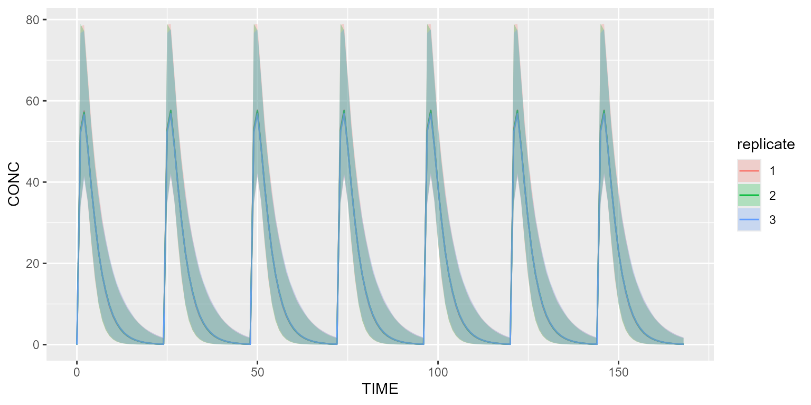

# Progress bar

This vignette explains how you can track the simulation progress thanks
to the package `progressr`.

### Track the simulation progress in an R script

Load package `progressr` as follows:

``` r
library(progressr)
```

The easiest way to track the progress is to add the following snippet
once for all in your script. By doing so, any call to the simulate
method of `campsis` will display the progress bar.

``` r
handlers(global=TRUE)
```

By default, the progress bar will only give the progress as a
percentage. Any user-custom handler may be provided. Please have a look
at the official
[documentation](https://CRAN.R-project.org/package=progressr) (Vignette
`progressr`: An Introduction / ‘Customizing how progress is reported’).

If you want to use the default handler from `campsis`, which gives you
more details about what’s being simulated and what’s the remaining time
(ETA), you can write:

``` r
handlers(campsis_handler())
```

If you don’t want your handler(s) to be global, you can also explicitly
call the method `with_progress`. The snippet below is an example of
simulation where this method is called.

``` r
dataset <- Dataset(1000) %>%
  add(Infusion(time=0, amount=1000, compartment=1, ii=24, addl=6)) %>%
  add(Observations(seq(0, 7*24)))

model <- model_suite$pk$`1cpt_fo`
results <- with_progress(simulate(model=model, dataset=dataset, dest="mrgsolve", seed=1, replicates=3))
shadedPlot(results, "CONC", "replicate")
```



Any handler may be provided as well:

``` r
results <- with_progress(simulate(model=model, dataset=dataset, dest="mrgsolve", seed=1, replicates=3), handlers=campsis_handler())
```

### Track the simulation progress in a targets project

The [targets](https://books.ropensci.org/targets/) package is a
Make-like pipeline tool for Statistics and data science in R. With
targets, you can maintain a reproducible workflow without repeating
yourself. It is the ideal pipeline tool to use for medium to large
simulation projects with Campsis.

The following script (`_targets.R`) gives you a brief overview of what
you can achieve with targets and how the progress bar can be enabled. It
is important to mention that `handlers(global=TRUE)` can’t be used in
such a script. If you try to do so, an error message will pop up.

``` r
library(targets)

source("R/my_script.R")

# Packages loaded by targets
packages <- c("campsis", "progressr")
tar_option_set(packages=packages)

# Enable progress bar
options(progressr.enable=TRUE)
progressr::handlers(campsis::campsis_handler())

list(
  tar_target(
    model,
    model_suite$pk$`1cpt_fo`
  ),
  tar_target(
    dataset,
    makeDataset(subjects=1000, dose=1000)
  ),
  tar_target(
    results,
    runSimulation(model=model, dataset=dataset, replicates=3)
  )
)
```

The R folder contains as much as possible of the code (or logic) being
executed, in the form of R functions. The snippet below shows the
content of `my_script.R`. An explicit call to `with_progress` will make
the progress bar appear when executing the target `results`.

``` r
makeDataset <- function(subjects, dose) {
  dataset <- Dataset(subjects=subjects) %>%
    add(Infusion(time=0, amount=dose, compartment=1, ii=24, addl=6)) %>%
    add(Observations(seq(0, 7*24)))
  return(dataset)
}

runSimulation <- function(model, dataset, replicates) {
  results <- with_progress(simulate(model=model, dataset=dataset, dest="mrgsolve",
                                    seed=1, replicates=replicates))
  return(results)
}
```

This small project can be downloaded by clicking the link below.

[Download targets
squeletton](data:application/zip;base64,UEsDBAoAAAAAAClhd1YAAAAAAAAAAAAAAAACAAAAUi9QSwMEFAACAAgAKWF3ViL0jBb1AAAAxwEAAA0AAABSL215X3NjcmlwdC5ShZC9TgMxEIT7k+4dVpEinSMjQRRBE1PRUFHwAMg5b4LBP4d3HQrEu2Nzlz8aXFmjmc8zbhuv3/FBsyZkWF/BNoeebQwd5c0b9kwSTCQU8NU2AOZknDJHnzpcBMzv59UMoI3pHsM2UwWy9aiuJWgfc2BVqRL66Aed2GNRbiRYq5YrWXNO3Yo/pKcNYdrr2o46wo+uwO4Wy5UQopoSck6hmyoW6btt2ibl8Gx9dr+xi4E+GnTyMEmW/OBsrxlpGpuQsmOqoU/Lry9DiruilbdHII4IdQlSR6BBYjXzaUfR7XEmxyX/HUI09StOddRZs/OlU7+69AdQSwMEFAACAAgAKWF3VtZvEykaAQAAAwIAAAoAAABfdGFyZ2V0cy5SfVC7boQwEOyR+AeLXGEkcrlTOhS6XB+RpPYtZsU5GGx5TUG+PubhU4ookovx7s7MzmrVOHAz9+A69JSnSZqQmZxEntVPwyxIOmX9sc7W1gN7A9lDh8S0gRZb1sxs56aJjb2XRyZ5JmGwpCgrWGad6RwSuUUmzAtjvTKjIPQ8sqoIdqfLCI1GFqmsAZcmG4/4XfCI61j1UX9eAvFeL8sbjK1GR3zfoyx3IPYOz1cnrcjzNGFLDrFlWb+MDaZFXfzCgibl8WD7w/UsrRffRkBDQkN3Xaby4k+ZFjyEoFEIenzdKpym5gulp+p8Op0K1hrCFeb/qIV0k/a0q7lpfFfDpGE5C1+XrLa1o20V7QPTaiXBh1M/bw5pEt4PUEsBAh4DCgAAAAAAKWF3VgAAAAAAAAAAAAAAAAIAAAAAAAAAAAAQAO1BAAAAAFIvUEsBAh4DFAACAAgAKWF3ViL0jBb1AAAAxwEAAA0AAAAAAAAAAQAAAKSBIAAAAFIvbXlfc2NyaXB0LlJQSwECHgMUAAIACAApYXdW1m8TKRoBAAADAgAACgAAAAAAAAABAAAApIFAAQAAX3RhcmdldHMuUlBLBQYAAAAAAwADAKMAAACCAgAAAAA=)

To run this project, simply open an R console within your targets folder
and type:

``` r
library(targets)
tar_make()
```
