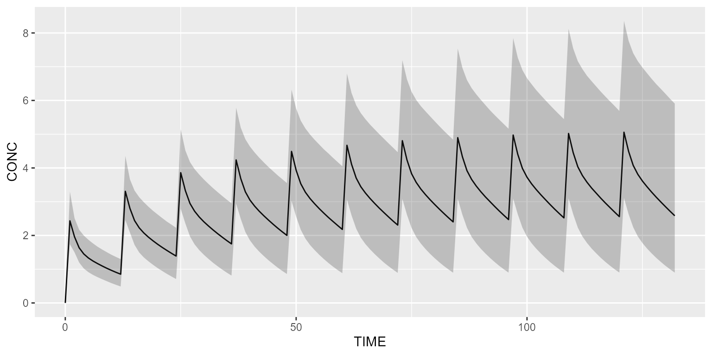

# Run your simulation in parallel

This vignette explains how Campsis can benefit from several CPU cores
for running your simulation efficiently.

### Base model and dataset

``` r
model <- model_suite$pk$`2cpt_fo_mm`

dataset <- Dataset(1000) %>%
  add(Bolus(time=0, amount=100, ii=12, addl=10)) %>%
  add(Observations(times=0:(11*12)))
```

### Run replicates in parallel

Sequential run:

``` r
tic()
results <- simulate(model=model, dataset=dataset, dest="mrgsolve", seed=1, outfun=~PI(.x, output="CONC"), replicates=100)
toc()
```

    ## 166.47 sec elapsed

Using 6 cores:

``` r
settings <- Settings(Hardware(cpu=6, replicate_parallel=TRUE))
```

``` r
tic()
results <- simulate(model=model, dataset=dataset, dest="mrgsolve", seed=1, outfun=~PI(.x, output="CONC"), replicates=10, settings=settings)
toc()
```

    ## 44.25 sec elapsed

``` r
vpcPlot(results)
```


Since there is no uncertainty on the parameters and since 1000 patients
are simulated in each replicate, the confidence intervals on the
percentiles are very low.

### Run scenarios in parallel

Instead of giving a fixed dose, let’s make the dose dynamic using a
`DOSE` covariate:

``` r
dataset_ <- dataset %>%
  add(Covariate("DOSE", 0)) %>%
  add(DoseAdaptation("DOSE"))
```

Let’s create one scenario per dose to be tested:

``` r
scenarios <- Scenarios()
for (dose in c(0.5,1,5,10,50,100,500,1000,5000,10000,50000,100000)) {
  scenarios <- scenarios %>%
    add(Scenario(name=paste0("DOSE=", dose), dataset=dataset_ %>% replace(Covariate("DOSE", dose))))
}
```

Sequential run:

``` r
tic()
results <- simulate(model=model, dataset=dataset_, dest="mrgsolve", seed=1, scenarios=scenarios)
toc()
```

    ## 30.91 sec elapsed

Using 6 cores (plan is auto-setup):

``` r
settings <- Settings(Hardware(cpu=6, scenario_parallel=TRUE))
```

``` r
tic()
results <- simulate(model=model, dataset=dataset_, dest="mrgsolve", seed=1, scenarios=scenarios, settings=settings)
toc()
```

    ## 18.54 sec elapsed

Using 6 cores (plan already setup from last execution):

``` r
settings <- Settings(Hardware(cpu=6, scenario_parallel=TRUE, auto_setup_plan=FALSE))
```

``` r
tic()
results <- simulate(model=model, dataset=dataset_, dest="mrgsolve", seed=1, scenarios=scenarios, settings=settings)
toc()
```

    ## 16.64 sec elapsed

Plot results:

``` r
# Re-arrange scenarios by natural order
results <- results %>% mutate(SCENARIO=factor(SCENARIO, levels=unique(SCENARIO)))

shadedPlot(results, "CONC", "SCENARIO") +
  facet_wrap(~SCENARIO, ncol=4, scales="free_y") +
  guides(colour="none", fill="none")
```


### Export dataset in parallel

In some particular cases, when the number of subjects is important
and/or the dataset is complex, it may be interesting to export the
dataset in parallel. Let’s illustrate this feature using a dataset that
contains a lot of subjects and treatment IOV (which is costly).

``` r
dataset_ <- dataset %>%
  setSubjects(24000) %>%
  add(IOV("IOV_KA", distribution=NormalDistribution(mean=0, sd=0.1))) # This step is costly
```

``` r
model_ <- model %>%
  replaceAll("ETA_KA", "ETA_KA + IOV_KA")
```

Sequential run:

``` r
tic()
settings <- Settings(Hardware(slice_size=4000))
results <- simulate(model=model_, dataset=dataset_, dest="mrgsolve", seed=1, settings=settings)
toc()
```

    ## 61.42 sec elapsed

Using 6 cores (plan is auto-setup):

``` r
settings <- Settings(Hardware(cpu=6, dataset_parallel=TRUE, dataset_slice_size=4000, slice_size=4000))
```

``` r
tic()
results <- simulate(model=model_, dataset=dataset_, dest="mrgsolve", seed=1, settings=settings)
toc()
```

    ## 54.76 sec elapsed

Using 6 cores (plan already setup from last execution):

``` r
settings <- Settings(Hardware(cpu=6, dataset_parallel=TRUE, dataset_slice_size=4000, slice_size=4000, auto_setup_plan=FALSE))
```

``` r
tic()
results <- simulate(model=model_, dataset=dataset_, dest="mrgsolve", seed=1, settings=settings)
toc()
```

    ## 53.69 sec elapsed

Plot results:

``` r
shadedPlot(results, "CONC")
```



### Run slices in parallel

It may be useful to simulate slices in parallel when the simulation time
per individual is high (e.g. long simulation). To illustrate this topic,
let’s dose and observe a drug over a 6-month period.

``` r
dataset_ <- Dataset(200) %>%
  add(Bolus(time=0, amount=100, ii=12, addl=364)) %>%
  add(Observations(times=0:(365*12)))
```

Sequential run (`rxode2`) :

``` r
tic()
results <- simulate(model=model, dataset=dataset_, dest="rxode2", seed=1)
toc()
```

    ## 206.31 sec elapsed

Sequential run (`mrgsolve`) :

``` r
tic()
results <- simulate(model=model, dataset=dataset_, dest="mrgsolve", seed=1)
toc()
```

    ## 8.56 sec elapsed

Using 6 cores (`rxode2`, plan is auto-setup):

``` r
settings <- Settings(Hardware(cpu=6, slice_parallel=TRUE))
```

``` r
tic()
results <- simulate(model=model, dataset=dataset_, dest="rxode2", seed=1, settings=settings)
toc()
```

    ## 163.75 sec elapsed

Using 6 cores (`mrgsolve`, plan is auto-setup):

``` r
settings <- Settings(Hardware(cpu=6, slice_parallel=TRUE))
```

``` r
tic()
results <- simulate(model=model, dataset=dataset_, dest="mrgsolve", seed=1, settings=settings)
toc()
```

    ## 6.78 sec elapsed

Please note that the default slice size for `mrgsolve` is 500, which
means that only 1 core was used in the previous example. For `rxode2`,
which works with a much smaller slice size of 6 subjects, paralleling
slices may be interesting for long simulations, as demonstrated here.

### Setup plan with package future

As you may have seen in the examples above, the argument
`auto_setup_plan` is `TRUE` by default. This means, that Campsis, will
setup your hardware plan every time you call the `simulate` method. This
comes at a high cost since the setup phase can take some time.

For repeated simulations, it may be useful to setup your plan manually
once for all. To do so, you can call `setupPlanDefault` on your settings
or hardware object:

``` r
settings <- Settings(Hardware(cpu=2, replicate_parallel=TRUE, auto_setup_plan=FALSE))
setupPlanDefault(settings)
```

If you do so, please don’t forget to set the argument `auto_setup_plan`
to FALSE, when you give these settings to the `simulate` method,
otherwise your plan is setup again…

For going back to the sequential execution (1 CPU core), you can call:

``` r
setupPlanSequential()
```

### Run Campsis in parallel within the pipeline tool targets

The [targets](https://books.ropensci.org/targets/) package is a
Make-like pipeline tool for Statistics and data science in R. With
targets, you can maintain a reproducible workflow without repeating
yourself. It is the ideal pipeline tool to use for medium to large
simulation projects with Campsis.

This package supports parallelisation and therefore can complete your
simulation workflow faster. The following script (`_targets.R`) gives
you a brief overview of how you can run several simulation targets in
parallel.

``` r
library(targets)

source("R/my_script.R")

# Packages loaded by targets
packages <- c("campsis", "progressr", "future")
tar_option_set(packages=packages, storage="worker", retrieval="worker")

# Prepare 3 workers
future::plan(future::multisession, workers=3)

list(
  tar_target(
    model,
    model_suite$pk$`1cpt_zo_abs_lag`,
    deployment="main"
  ),
  tar_target(
    dataset,
    makeDataset(subjects=1000, dose=1000),
    deployment="main"
  ),
  tar_target(
    results1,
    runSimulation(model=model, dataset=dataset, replicates=10, seed=1),
    deployment="worker"
  ),
  tar_target(
    results2,
    runSimulation(model=model, dataset=dataset, replicates=10, seed=2),
    deployment="worker"
  ),
  tar_target(
    results3,
    runSimulation(model=model, dataset=dataset, replicates=10, seed=3),
    deployment="worker"
  )
)
```

This small project can be downloaded by clicking the link below.

[Download targets
squeletton](data:application/zip;base64,UEsDBAoAAAAAAClhd1YAAAAAAAAAAAAAAAACAAAAUi9QSwMEFAACAAgAKWF3ViuLKrf5AAAA0gEAAA0AAABSL215X3NjcmlwdC5ShY+9TgMxEIT7k+4dVpEinZGRSBRBg6loqCh4AOScN4nBP4d3HQrEu2Mnl4SjwYW1Gs18mmkbr9/xUbMmZLi/hk0OPdsYOsrrN+yZJJhIKOCrbQDMxThmzj51OgTMH+bVDKCN6Z7CJlMFsvWobiRoH3NgVakS+ugHndhjURYSrFXLlaw5p27FH9LzmjDtdW1HHeFHV2B3V8uVEKKaEnJOoRsrFum7bdom5fBifXaH2GSgjwadPE2SJT8422vGMpkQjVqMoxNSdkw1/Gl59zqkuC1a6XAE4xGlpkB1BhskVjOfthTdHmfyuOi/d6hQv9/N1OWcjB4r1tE/UEsDBBQAAgAIAClhd1besZsTTwEAAG8DAAAKAAAAX3RhcmdldHMuUq2Rz07DMAzG75X6DlHYoZMKbOttIjceAI0H6NzUVKFpE8UpqDw96Z8gDpMmwaQcbCef/ftirSoHbsw8uAY9bdMkTcgMTmLGT4/dWJJ0yvqHE5+v7tgLyBYaJKYN1FizamSrNk1svHu6ZzLjEjpLinjOuHWmcUjkpuRt8IPDqWFQlsZ6ZfqS0GdRL2KQM/LGhUjwT+NanOQOvVP4AfqnFskcWnDICrbUA9Ay6Xi0GvosJt2gvaIAE8bm8a0o5i5akc/ShE2eysXXnDLWmRp1/isuaVAeN7bdnPfS+vLLlFBRqaE5r89qtNqMHfZe8A5Uz6fyNr/YvgYP4QviAGjxealkNFTvKD2J/W63y1ltCOdw+4cpYQXBPO1XqRv6VxW+A6YNZLMrsfiMPCJyBanVSoLHCSTsBbEW+0sM61KuUxxuRHH4F0VxI4riGkWahPMNUEsBAh4DCgAAAAAAKWF3VgAAAAAAAAAAAAAAAAIAAAAAAAAAAAAQAO1BAAAAAFIvUEsBAh4DFAACAAgAKWF3ViuLKrf5AAAA0gEAAA0AAAAAAAAAAQAAAKSBIAAAAFIvbXlfc2NyaXB0LlJQSwECHgMUAAIACAApYXdW3rGbE08BAABvAwAACgAAAAAAAAABAAAApIFEAQAAX3RhcmdldHMuUlBLBQYAAAAAAwADAKMAAAC7AgAAAAA=)

To run this project, nothing is easier. Open an R console within your
targets folder and type:

``` r
library(targets)
tar_make_future(workers=3)
```
